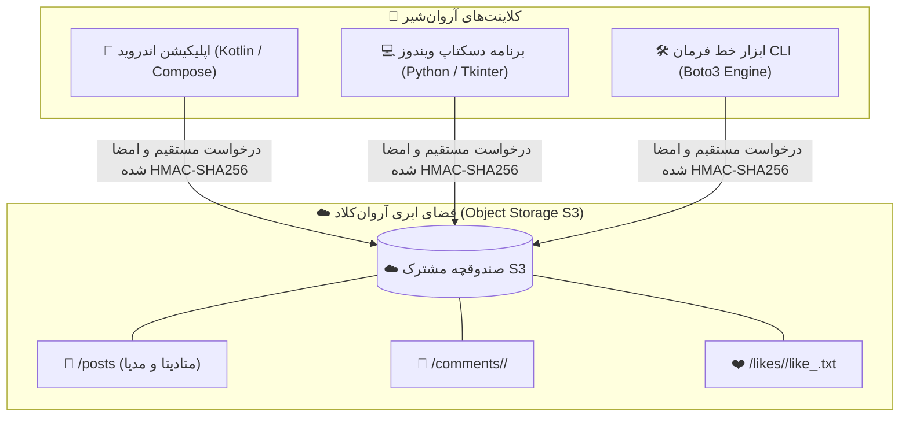

<div dir="rtl">

<div align="center">
  
  <h1 align="center">آروان‌شیر (ArvanShare)</h1>
  <p align="center">
    <strong>شبکه اجتماعی خصوصی و کاملاً بدون سرور (Serverless) قدرت‌گرفته از فضای ابری آروان‌کلاد ☁️</strong>
  </p>

  <p align="center">
    <a href="https://github.com/HasanMfar/arvanshare/releases/latest"></a>
    <a href="https://hasanmfar.github.io/arvanshare/"></a>
    <a href="https://android.com"></a>
    <a href="https://python.org"></a>
    <a href="https://github.com/HasanMfar/arvanshare/blob/main/LICENSE"></a>
  </p>

  <p align="center">
    <a href="https://hasanmfar.github.io/arvanshare/">🌐 <strong>مشاهده صفحه وب پروژه (Landing Page)</strong></a> • 
    <a href="README.md">🇺🇸 <strong>Read in English</strong></a>
  </p>
</div>

---

**آروان‌شیر (ArvanShare)** یک شبکه اجتماعی خصوصی و بدون سرور (Serverless) برای حلقه کوچکی از دوستان، خانواده یا اعضای یک تیم کاری است. در این معماری، **هیچ سرور بک‌اندی وجود ندارد و هیچ دیتابیس مرکزی نگهداری نمی‌شود**؛ در عوض تمامی داده‌ها (پست‌ها، کامنت‌ها، لایک‌ها و فایل‌های پیوست) مستقیماً روی **صندوقچه فضای ابری آروان‌کلاد (Object Storage سازگار با S3)** ذخیره و همگام‌سازی می‌شوند.

کلاینت‌ها با کلیدهای امن و مستقیم به فضای ابری متصل شده و به لطف ساختار اتمیک فایل‌ها، داده‌ها بدون تداخل و بدون نیاز به هاست اختصاصی به‌روز می‌شوند.

---

## 📱 پیش‌نمایش محیط برنامه

<div align="center">
  <a href="https://hasanmfar.github.io/arvanshare/">
    
  </a>
</div>

---

## ✨ ویژگی‌های کلیدی

- 🚀 **۱۰۰٪ بدون سرور (100% Serverless):** بدون نیاز به توسعه، نگهداری، پچ امنیتی یا پرداخت هزینه سرورهای Node.js یا جنگو.
- 📱 **پوشش کامل پلتفرم‌ها:** اپلیکیشن نیتیو اندروید (Jetpack Compose)، کلاینت پرتابل ویندوز (Tkinter) و رابط خط فرمان (CLI).
- ⚡ **آفلاین-فرست (Offline-First):** اپ اندروید متادیتای پست‌ها را در دیتابیس محلی Room کش می‌کند تا فید بدون تأخیر باز شود.
- 🛡️ **ایمن در برابر تداخل (Race-Safe):** ساختار نشانگرهای اتمیک (`like_<username>.txt`) باعث می‌شود لایک و کامنت همزمان چند کاربر هیچ‌گاه خراب نشود.
- 🔒 **امنیت و حریم خصوصی بالا:** تبادل داده‌ها با کلیدهای اختصاصی باکت و امضای امن HMAC-SHA256 انجام می‌پذیرد.
- 🌙 **پشتیبانی کامل از حالت تاریک و روشن:** رابط کاربری مدرن Material 3 با رنگ‌بندی ایندیگو و فیروزه‌ای جذاب.

---

## 🏗️ معماری و ساختار داده‌ها (S3 Data Model)

تمام داده‌های شبکه اجتماعی بر روی کلیدهای فضای ابری S3 نگاشت شده‌اند:

<div align="center">
  
</div>

### ساختار پوشه‌ها در فضای ابری:

- **پست‌ها (`/posts/`):** هر پست یک فایل JSON مستقل (`<timestamp>_<author>_post.json`) به همراه فایل مدیا (`<timestamp>_<author>_image.jpg`) است.
- **کامنت‌ها (`/comments/<post_id>/`):** هر کامنت یک فایل JSON کوچک در پوشه اختصاصی آن پست ذخیره می‌شود.
- **لایک‌های اتمیک (`/likes/<post_id>/`):** هر لایک یک فایل متنی با حجم صفر (`like_<username>.txt`) است. متدهای `PutObject` و `DeleteObject` در S3 اتمیک هستند؛ بنابراین چندین لایک همزمان هیچ مشکلی ایجاد نمی‌کنند.



---

## 🚀 راهنمای شروع و استفاده

### 📱 ۱. اپلیکیشن اندروید (Kotlin / Jetpack Compose)
یک کلاینت مدرن و نیتیو اندروید با کش محلی Room و بارگذاری بهینه مدیا با Coil.

**نحوه اجرا:**
۱. آخرین فایل `.apk` امضا شده را از [صفحه ریلیزها (Releases)](https://github.com/HasanMfar/arvanshare/releases/latest) دانلود کنید.
۲. برنامه را نصب و اجرا کنید.
۳. در اولین ورود، نام نمایشی و مشخصات باکت آروان‌کلاد را وارد نمایید.

**بیلد از سورس‌کد:**
پروژه را با **Android Studio** باز کرده و ماژول `app` را اجرا کنید.

---

### 💻 ۲. برنامه دسکتاپ ویندوز (Python / Tkinter)
یک کلاینت سبک و کامل برای ویندوز همراه با فید کارتی، مشاهده پیوست‌ها و دارک‌مود.

**اجرای فایل پرتابل (Standalone EXE):**
۱. فایل `ArvanShare-*.exe` را از [صفحه ریلیزها](https://github.com/HasanMfar/arvanshare/releases/latest) دانلود کنید.
۲. روی آن دوبار کلیک کنید — نیازی به نصب پایتون نیست. تنظیمات در فایل `config.ini` کنار برنامه ذخیره می‌شوند.

**اجرا از روی سورس کد:**
۱. مطمئن شوید Python 3.10 یا بالاتر نصب است.
۲. روی `python\ArvanShare.bat` دوبار کلیک کرده یا در ترمینال اجرا کنید:
   ```bash
   cd python
   python -m venv .venv
   .venv\Scripts\python -m pip install -r requirements.txt
   .venv\Scripts\python desktop.py
   ```

---

### 🛠️ ۳. ابزار خط فرمان (CLI)
ابزار مرجع برای مدیریت فید، تست و نوشتن ربات‌های خودکارسازی.

**راه‌اندازی:**
```bash
cd python
python -m venv .venv
.venv\Scripts\python -m pip install -r requirements.txt
copy config.example.ini config.ini
# اطلاعات باکت را در config.ini وارد کنید
```

**دستورات پرکاربرد:**
```bash
# ایجاد ساختار اولیه پوشه‌ها در باکت
.venv\Scripts\python arvanshare.py init-structure

# ارسال پست جدید
.venv\Scripts\python arvanshare.py upload-post --text "سلام از آروان‌شیر!" --as Ali

# دریافت لیست پست‌ها
.venv\Scripts\python arvanshare.py list-posts

# مشاهده جزییات یک پست خاص
.venv\Scripts\python arvanshare.py get-post <post_id>
```

---

## ☁️ راهنمای گام‌به‌گام راه‌اندازی باکت آروان‌کلاد

برای استفاده از آروان‌شیر، تنها به یک صندوقچه فضای ابری در آروان‌کلاد نیاز دارید. شما به ۴ بخش اطلاعات نیاز خواهید داشت: **نام صندوقچه (Bucket Name)**، **آدرس S3 (Endpoint)**، **کلید دسترسی (Access Key)** و **کلید محرمانه (Secret Key)**.

۱. **ساخت صندوقچه (Bucket):**
   - وارد [پنل آروان‌کلاد](https://panel.arvancloud.ir) شده و به بخش **فضای ابری (Object Storage)** بروید.
   - روی **صندوقچه جدید** کلیک کنید، نام دلخواه خود (مثلاً `my-family-share`) را بنویسید و سطح دسترسی را **خصوصی (Private)** انتخاب نمایید.
۲. **دریافت آدرس S3 Endpoint:**
   - در داشبورد فضای ابری، آدرس Endpoint منطقه خود را کپی کنید (مثلاً `https://s3.ir-thr-at1.arvanstorage.ir`).
۳. **تولید کلیدهای دسترسی (API Keys):**
   - به بخش **کلیدهای دسترسی (API Keys)** بروید و روی **کلید جدید** کلیک کنید.
   - دسترسی را روی **خواندن و نوشتن (Read/Write)** قرار داده و حتماً **کلید را به صندوقچه متصل (Attach)** کنید.
   - مقادیر **Access Key** و **Secret Key** را کپی و در جای امن ذخیره کنید.
۴. **اشتراک‌گذاری با افراد گروه:**
   - این ۴ مشخصه را به افراد حلقه خود بدهید تا در اولین اجرای اپلیکیشن وارد کنند.

---

## 🔐 سیستم بیلد خودکار (GitHub Actions)

با انتشار هر تگ نسخه جدید در گیت‌هاب (مانند `v1.0.0-beta.2`):
۱. فایل اندروید APK به صورت خودکار کامپایل و امضا (Sign) می‌شود.
۲. تست‌های پایتون اجرا شده و فایل پرتابل ویندوز با PyInstaller ساخته می‌شود.
۳. یک ریلیز رسمی در گیت‌هاب همراه با فایل‌های نصبی ایجاد می‌گردد.

---

## 📄 مجوز (License)

این پروژه تحت مجوز متن‌باز **MIT License** منتشر شده است.

</div>
