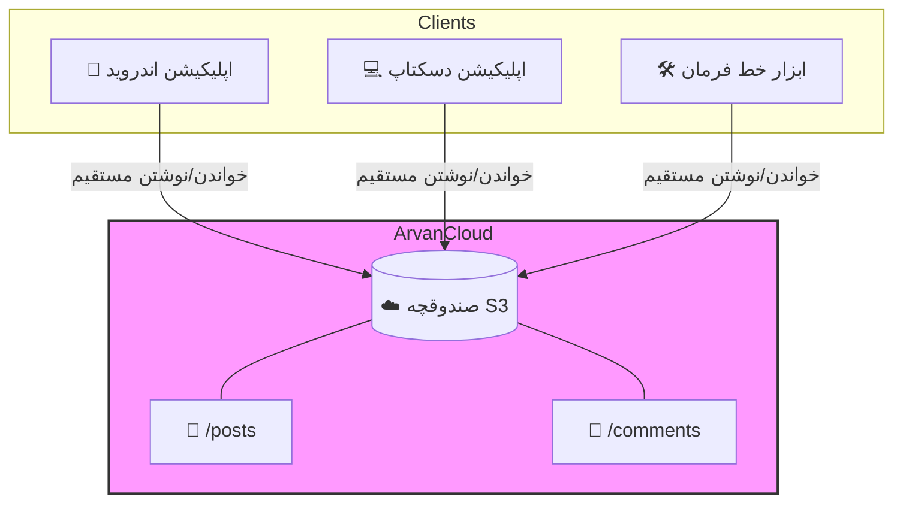

<div dir="rtl">

<div align="center">
  <h1 align="center">آروان‌شیر (ArvanShare)</h1>
  <p align="center">
    <strong>یک شبکه اجتماعی خصوصی و بدون سرور (Serverless) قدرت گرفته از آروان‌کلاد ☁️</strong>
  </p>

  <p align="center">
    <a href="https://github.com/HasanMfar/arvanshare/releases/latest"></a>
    <a href="https://android.com"></a>
    <a href="https://python.org"></a>
    <a href="https://github.com/HasanMfar/arvanshare/blob/main/LICENSE"></a>
  </p>
  <p align="center">
    <a href="README.md">🇺🇸 Read in English</a>
  </p>
</div>

---

**آروان‌شیر** یک شبکه اجتماعی خصوصی و بدون سرور (serverless) برای حلقه کوچکی از دوستان، خانواده یا یک تیم است. این برنامه هیچ سرور بک‌اند یا دیتابیسی ندارد — در عوض، **تمامی داده‌ها (پست‌ها، کامنت‌ها، لایک‌ها و فایل‌های پیوست) مستقیماً روی یک باکت Object Storage آروان‌کلاد** (سازگار با S3) ذخیره می‌شوند.

کلاینت‌ها مستقیماً به باکت متصل می‌شوند و از یک ساختار فایل یکسان و امن در برابر تداخل (race-condition safe) استفاده می‌کنند تا نیازی به سرور واسط نباشد.

## ✨ ویژگی‌ها (Features)
- 🚀 **کاملاً بدون سرور (100% Serverless):** بدون نیاز به توسعه و نگهداری بک‌اند. فقط به یک باکت S3 نیاز دارید!
- 📱 **پشتیبانی از پلتفرم‌های مختلف:** دارای اپلیکیشن نیتیو اندروید، اپلیکیشن ویندوز و یک ابزار کامند لاین (CLI).
- ⚡ **آفلاین-فرست (Offline-first):** اپلیکیشن اندروید متادیتا را کش می‌کند تا فید برنامه در کسری از ثانیه لود شود.
- 🌙 **حالت تاریک (Dark Mode):** رابط کاربری مدرن به همراه دارک مود فعال در تمامی پلتفرم‌ها.
- 🔒 **خصوصی و امن:** فقط افرادی که API Key باکت را در اختیار دارند می‌توانند پست‌ها را ببینند یا محتوا اضافه کنند.
- 🛡️ **ایمن در برابر تداخل (Race-Condition Safe):** معماری مبتنی بر فایل باعث می‌شود تا آپدیت‌های همزمان باهم تداخلی نداشته باشند.

---

## 📸 تصاویر محیط برنامه (Screenshots)

*(در این قسمت می‌توانید تصاویر محیط برنامه‌های اندروید و ویندوز را قرار دهید)*

<div align="center">
  
  &nbsp;&nbsp;&nbsp;&nbsp;
  
</div>

---

## 🏗️ معماری و مدل داده‌ها

کل این شبکه اجتماعی بر روی کلیدهای (Keys) فضای ابری S3 پیاده‌سازی شده است. از آنجا که هیچ دیتابیس مرکزی برای مدیریت همزمانی وجود ندارد، این مدلِ داده از آپدیت فایل‌های مشترک جلوگیری می‌کند:

- **پست‌ها:** هر پست یک فایل JSON جدید و منحصربه‌فرد است.
- **کامنت‌ها:** هر کامنت یک فایل جدید در پوشه اختصاصی همان پست است.
- **لایک‌ها:** به جای یک شمارنده، هر لایک فقط یک فایل خالی متنی با فرمت `like_<username>.txt` است. چون ساخت و حذف فایل در S3 به صورت اتمیک انجام می‌شود، لایک کردنِ همزمانِ چندین کاربر هرگز باعث خرابی داده‌ها نمی‌شود.



---

## 🚀 راهنمای راه‌اندازی (Getting Started)

### 📱 اپلیکیشن اندروید (Kotlin / Jetpack Compose)
یک اپلیکیشن نیتیو و مدرن اندروید با قابلیت آفلاین-فرست. رسانه‌ها در صورت نیاز از طریق Coil دانلود می‌شوند.

**برای اجرا:**
۱. فایل `.apk` را مستقیماً از [صفحه Releases](https://github.com/HasanMfar/arvanshare/releases) دانلود کنید.
۲. یا پروژه را در Android Studio باز کرده و ماژول `app` را بیلد کنید.
۳. در اولین اجرا، نام نمایشی خود و اطلاعات باکت آروان‌کلاد را وارد کنید.

### 💻 اپلیکیشن دسکتاپ ویندوز (Python / Tkinter)
یک کلاینت دسکتاپ با امکانات کامل همراه با فید کارتی و پشتیبانی از فایل‌های پیوست.

**برای اجرا (نسخه پرتابل):**
۱. فایل `ArvanShare-*.exe` را از [صفحه Releases](https://github.com/HasanMfar/arvanshare/releases) دانلود کنید.
۲. برای اجرا روی آن دوبار کلیک کنید — نیازی به نصب پایتون نیست. تنظیمات به صورت محلی ذخیره می‌شوند.

**برای اجرا (از سورس کد):**
۱. مطمئن شوید که Python 3.10 یا بالاتر نصب شده است.
۲. روی فایل `python\ArvanShare.bat` دوبار کلیک کنید تا وابستگی‌ها نصب و برنامه اجرا شود.

### 🛠️ رابط خط فرمان (CLI)
یک ابزار CLI مرجع برای مدیریت فید یا ساخت پست به صورت خودکار (Automation).

**راه‌اندازی:**
```bash
cd python
python -m venv .venv
.venv\Scripts\python -m pip install -r requirements.txt
copy config.example.ini config.ini
# فایل config.ini را با اطلاعات خود ویرایش کنید
```

**نحوه استفاده:**
```bash
.venv\Scripts\python arvanshare.py init-structure
.venv\Scripts\python arvanshare.py upload-post --text "سلام به همه!" --as Ali
.venv\Scripts\python arvanshare.py list-posts
.venv\Scripts\python arvanshare.py get-post <post_id>
```

---

## ☁️ تنظیم باکت آروان‌کلاد (بک‌اند بدون سرور)

برای استفاده از آروان‌شیر، به یک باکت اشتراکی نیاز دارید که تمام داده‌ها در آن ذخیره شوند.
شما به ۴ بخش اطلاعات نیاز دارید: **نام صندوقچه (Bucket Name)**، **آدرس S3 (Endpoint)**، **Access Key** و **Secret Key**. برای دریافت آن‌ها مراحل زیر را طی کنید:

۱. **ساخت صندوقچه (Bucket):** 
   - به [پنل کاربری آروان‌کلاد](https://panel.arvancloud.ir) بروید -> **فضای ابری (Object Storage)**.
   - روی **صندوقچه جدید** کلیک کنید. یک نام انتخاب کنید (مثلاً `my-family-share`) و سطح دسترسی آن را **خصوصی (Private)** قرار دهید. این همان **نام باکت** شماست.

۲. **دریافت آدرس S3 (Endpoint):**
   - در داشبورد فضای ابری، می‌توانید **آدرس S3 Endpoint** مربوط به منطقه خود را مشاهده کنید (مثلاً `https://s3.ir-thr-at1.arvanstorage.ir`). این مقدار همان **Endpoint** است.

۳. **ساخت کلیدهای دسترسی (API Keys):**
   - در منوی فضای ابری، به بخش **کلیدهای دسترسی (API Keys)** بروید.
   - روی **کلید جدید** کلیک کنید. یک نام برای آن انتخاب کنید و سطح دسترسی را روی **خواندن و نوشتن (Read/Write)** قرار دهید.
   - **مهم:** حتماً کلید ساخته شده را به صندوقچه‌ای که در مرحله اول ساختید متصل (Attach) کنید.
   - پس از ایجاد، دو مقدار **Access Key** و **Secret Key** نمایش داده می‌شود. *(توجه: Secret Key فقط یک بار نمایش داده می‌شود، پس آن را در جای امن ذخیره کنید)*.

این ۴ بخش اطلاعات را به همه افراد حلقه خود بدهید تا در اولین اجرا وارد برنامه کنند.

---

## 🔐 ریلیزها و GitHub Actions

هنگامی که یک تگ نسخه جدید (مثلاً `v1.0.0-beta.1`) پوش (push) می‌شود، GitHub Actions به طور خودکار:
۱. فایل اندروید APK را بیلد کرده و امضا (Sign) می‌کند.
۲. فایل نصبی ویندوز `.exe` را می‌سازد.
۳. یک ریلیز جدید در گیت‌هاب ایجاد کرده و هر دو فایل را به آن پیوست می‌کند.

*(برای آموزش تنظیمِ secretهای مربوط به امضای اندروید به فایل `keystore/README.md` مراجعه کنید).*

</div>
