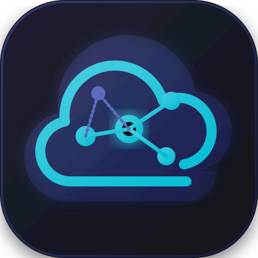
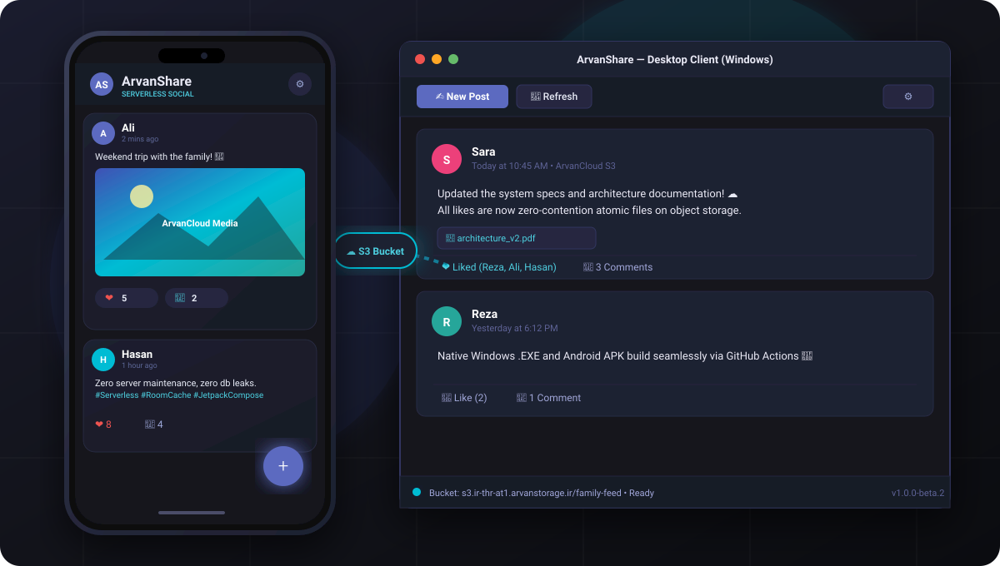
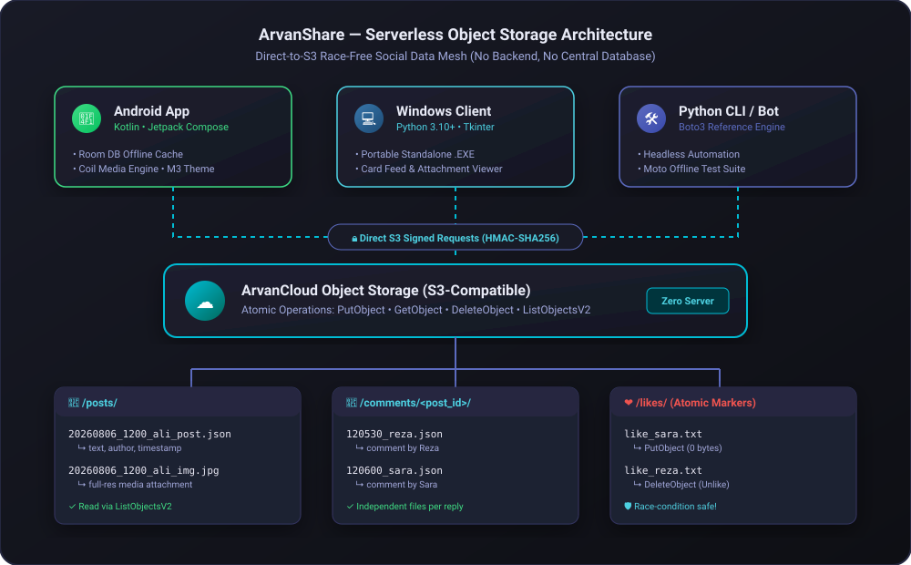
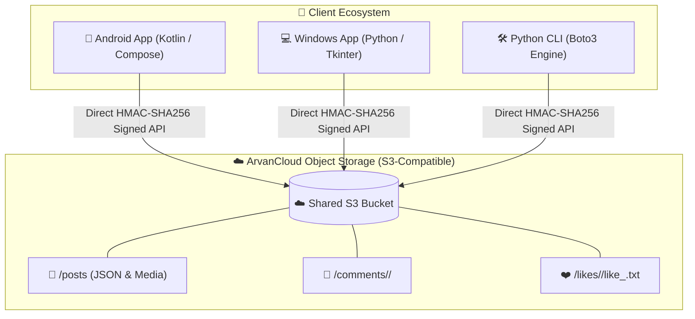

<div align="center">
  
  <h1 align="center">ArvanShare</h1>
  <p align="center">
    <strong>A Serverless, Private Social Feed Powered by ArvanCloud S3 ☁️</strong>
  </p>

  <p align="center">
    <a href="https://github.com/HasanMfar/arvanshare/releases/latest"></a>
    <a href="https://hasanmfar.github.io/arvanshare/"></a>
    <a href="https://android.com"></a>
    <a href="https://python.org"></a>
    <a href="https://github.com/HasanMfar/arvanshare/blob/main/LICENSE"></a>
  </p>

  <p align="center">
    <a href="https://hasanmfar.github.io/arvanshare/">🌐 <strong>Explore Project Landing Page</strong></a> • 
    <a href="README-fa.md">🇮🇷 <strong>خواندن به زبان فارسی</strong></a>
  </p>
</div>

---

**ArvanShare** is a serverless, private social network designed for a small circle of friends, family, or a team. There is **no backend server** and **no central database**. Instead, all data (posts, comments, likes, and media attachments) is stored directly on an **ArvanCloud Object Storage bucket** (S3-compatible).

Clients connect directly to the bucket, utilizing a race-condition-safe file layout to ensure seamless, real-time synchronization without any intermediate servers or ongoing hosting costs.

---

## 📱 App Preview

<div align="center">
  <a href="https://hasanmfar.github.io/arvanshare/">
    
  </a>
</div>

---

## ✨ Features

- 🚀 **100% Serverless:** No Node.js, PHP, or Python backend to manage, patch, or deploy. Just an S3 bucket!
- 📱 **Cross-Platform Ecosystem:** Comes with a native Android app (Jetpack Compose), a portable Windows desktop app (Python/Tkinter), and an automation CLI.
- ⚡ **Offline-First & Cached:** The Android app caches feed metadata locally via Room DB for instant loading on launch.
- 🛡️ **Race-Condition Safe:** Like and comment actions use atomic marker files (`like_<username>.txt`), ensuring concurrent writes never corrupt social data.
- 🔒 **Private & Secure:** Only users with the Bucket API Keys can access or publish content via HMAC-SHA256 direct S3 signed requests.
- 🌙 **Dark & Light Mode Support:** Modern, polished Material 3 theme with deep indigo and vibrant cyan accents across all clients.

---

## 🏗️ Architecture & Data Model

The entire social network is mapped to S3 keys. Because there is no central database to coordinate concurrent writes, the data model avoids modifying shared files:

<div align="center">
  
</div>

### S3 Key Structure:

- **Posts:** Each post is stored as a unique JSON file (`/posts/<timestamp>_<author>_post.json`) along with any high-resolution media attachment (`/posts/<timestamp>_<author>_image.jpg`).
- **Comments:** Stored in dedicated per-post directories (`/comments/<post_id>/<timestamp>_<author>.json`).
- **Atomic Likes:** A like is represented by an empty marker file (`/likes/<post_id>/like_<username>.txt`). S3 `PutObject` and `DeleteObject` operations are atomic, making concurrent likes 100% conflict-free.



---

## 🚀 Getting Started

### 📱 1. Android App (Kotlin / Jetpack Compose)
A modern, offline-first native Android app with smooth slide-in animations and on-demand media loading via Coil.

**To Run:**
1. Download the latest signed `.apk` from the [Releases Page](https://github.com/HasanMfar/arvanshare/releases/latest).
2. Install and launch the app.
3. On first launch, enter your display name and your ArvanCloud bucket credentials.

**To Build from Source:**
1. Clone the repository and open in **Android Studio**:
   ```bash
   git clone https://github.com/HasanMfar/arvanshare.git
   ```
2. Build and run the `app` module on your device or emulator.

---

### 💻 2. Windows Desktop App (Python / Tkinter)
A fully-featured desktop client with a card-style feed, attachment viewer, and dark mode.

**To Run (Portable Standalone):**
1. Download `ArvanShare-*.exe` from the [Releases Page](https://github.com/HasanMfar/arvanshare/releases/latest).
2. Double-click to run — no Python installation or dependencies needed. Settings are saved locally in `config.ini`.

**To Run from Source:**
1. Ensure Python 3.10+ is installed.
2. Double-click `python\ArvanShare.bat` or run:
   ```bash
   cd python
   python -m venv .venv
   .venv\Scripts\python -m pip install -r requirements.txt
   .venv\Scripts\python desktop.py
   ```

---

### 🛠️ 3. Command Line Interface (CLI)
A reference CLI tool for automating posts, managing feeds, or running bot integrations.

**Setup:**
```bash
cd python
python -m venv .venv
.venv\Scripts\python -m pip install -r requirements.txt
copy config.example.ini config.ini
# Edit config.ini with your bucket details
```

**Usage:**
```bash
# Initialize folder structure on S3
.venv\Scripts\python arvanshare.py init-structure

# Upload a post
.venv\Scripts\python arvanshare.py upload-post --text "Hello world from ArvanShare!" --as Ali

# List all posts
.venv\Scripts\python arvanshare.py list-posts

# Inspect a specific post
.venv\Scripts\python arvanshare.py get-post <post_id>
```

---

## ☁️ Setting up ArvanCloud Object Storage (Serverless Backend)

To use ArvanShare, you only need one shared ArvanCloud Object Storage bucket. You will need 4 credentials: **Bucket Name**, **S3 Endpoint**, **Access Key**, and **Secret Key**.

1. **Create a Bucket:**
   - Sign in to [panel.arvancloud.ir](https://panel.arvancloud.ir) and navigate to **Object Storage (فضای ابری)**.
   - Click **New Bucket**. Choose a unique name (e.g. `my-family-share`) and set the access level to **Private**.
2. **Get the S3 Endpoint:**
   - In your Object Storage dashboard, copy the **S3 Endpoint** URL for your region (e.g., `https://s3.ir-thr-at1.arvanstorage.ir`).
3. **Generate API Keys (Access & Secret Key):**
   - In the Object Storage menu, go to **API Keys (کلیدهای دسترسی)**.
   - Click **New Key**, select **Read & Write** permissions, and **attach the key to your bucket**.
   - Copy both the **Access Key** and **Secret Key** *(Note: Secret Key is shown only once)*.
4. **Distribute to Your Circle:**
   - Share these 4 items (Endpoint, Bucket, Access Key, Secret Key) with your trusted members. Each member enters them on the first app launch.

---

## 🔐 Automated Releases (GitHub Actions)

When a version tag (e.g. `v1.0.0-beta.2`) is pushed to GitHub, the CI/CD pipeline automatically:
1. Builds and signs the Android APK using Android Keystore secrets.
2. Runs the Python test suite and compiles the standalone Windows `.exe` using PyInstaller.
3. Publishes a GitHub Release with both assets attached.

---

## 📄 License

This project is licensed under the **MIT License** — see the [LICENSE](LICENSE) file for details.
