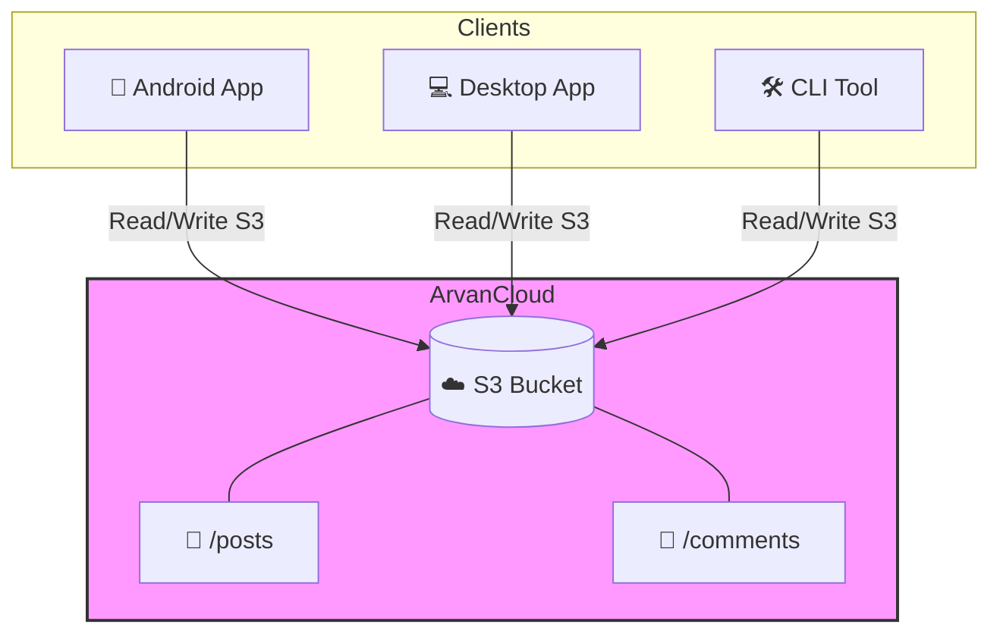

<div align="center">
  <h1 align="center">ArvanShare</h1>
  <p align="center">
    <strong>A Serverless, Private Social Feed Powered by ArvanCloud S3 ☁️</strong>
  </p>

  <p align="center">
    <a href="https://github.com/HasanMfar/arvanshare/releases/latest"></a>
    <a href="https://android.com"></a>
    <a href="https://python.org"></a>
    <a href="https://github.com/HasanMfar/arvanshare/blob/main/LICENSE"></a>
  </p>
  <p align="center">
    <a href="README-fa.md">🇮🇷 خواندن به زبان فارسی</a>
  </p>
</div>

---

**ArvanShare** is a serverless, private social network designed for a small circle of friends, family, or a team. There is **no backend server** and **no database**. Instead, all data (posts, comments, likes, and media) is stored directly on an **ArvanCloud Object Storage bucket** (S3-compatible).

Clients connect directly to the bucket, utilizing a race-condition-safe file layout to ensure seamless synchronization without a middleman.

## ✨ Features
- 🚀 **100% Serverless:** No backend maintenance or deployment required. Just an S3 bucket!
- 📱 **Cross-Platform Clients:** Comes with a native Android app, a Windows desktop app, and a CLI tool.
- ⚡ **Offline-first & Cached:** The Android app caches metadata using Room DB for instant feed loading.
- 🌙 **Dark Mode Support:** Modern UI with dark-mode enabled out of the box across apps.
- 🔒 **Private & Secure:** Only users with the Bucket API Keys can access or post content.
- 🛡️ **Race-Condition Safe:** File-based architecture avoids central database conflicts.

---

## 📸 Screenshots

*(Replace these placeholders with actual screenshots of your apps)*

<div align="center">
  
  &nbsp;&nbsp;&nbsp;&nbsp;
  
</div>

---

## 🏗️ Architecture & Data Model

The entire social network is mapped to S3 keys. There is no central database to handle concurrent writes, so the data model avoids modifying shared files:

- **Posts:** Each post is a new, unique JSON file.
- **Comments:** Each comment is a new, unique file inside the post's dedicated folder.
- **Likes:** A like is simply an empty `like_<username>.txt` file. S3 `PutObject` and `DeleteObject` are atomic, so multiple users liking at the exact same time will never corrupt data.



---

## 🚀 Getting Started

### 📱 Android App (Kotlin / Jetpack Compose)
A modern, offline-first native Android app. It downloads full-res media on demand via Coil.

**To run:**
1. Download the `.apk` from the [Releases page](https://github.com/HasanMfar/arvanshare/releases).
2. Or build from source by opening the project in Android Studio and running the `app` module.
3. On first launch, enter your display name and the ArvanCloud bucket details.

### 💻 Windows Desktop App (Python / Tkinter)
A fully-featured desktop client with a card-style feed and attachment support.

**To run (Portable):**
1. Download `ArvanShare-*.exe` from the [Releases page](https://github.com/HasanMfar/arvanshare/releases).
2. Double-click to run — no Python installation needed. Settings are saved locally alongside the `.exe`.

**To run (From source):**
1. Ensure you have Python 3.10+ installed.
2. Double-click `python\ArvanShare.bat`. It will guide you to create the virtual environment and install dependencies (`boto3`).

### 🛠️ Command Line Interface (CLI)
A reference CLI tool for managing the feed or automating posts.

**Setup:**
```bash
cd python
python -m venv .venv
.venv\Scripts\python -m pip install -r requirements.txt
copy config.example.ini config.ini
# Edit config.ini with your details
```

**Usage:**
```bash
.venv\Scripts\python arvanshare.py init-structure
.venv\Scripts\python arvanshare.py upload-post --text "Hello everyone!" --as Ali
.venv\Scripts\python arvanshare.py list-posts
.venv\Scripts\python arvanshare.py get-post <post_id>
```

---

## ☁️ Setting up the ArvanCloud Bucket (Serverless backend)

To use ArvanShare, you need one shared bucket where all the data lives.
You will need 4 pieces of information: **Bucket Name**, **S3 Endpoint**, **Access Key**, and **Secret Key**. Follow these steps to get them:

1. **Create a Bucket:**
   - Go to [panel.arvancloud.ir](https://panel.arvancloud.ir) -> **Object Storage**.
   - Click **New Bucket**. Choose a unique name (e.g. `my-family-share`) and set the access level to **Private**. This is your **Bucket Name**.

2. **Get the S3 Endpoint:**
   - In the Object Storage dashboard, you will see the **S3 Endpoint** URL corresponding to your region (e.g., `https://s3.ir-thr-at1.arvanstorage.ir`). This is your **Endpoint**.

3. **Generate API Keys (Access & Secret Key):**
   - Go to **API Keys** in the Object Storage menu.
   - Click **New Key**. Give it a name and ensure the access level is **Read & Write**.
   - **Important:** Attach this new key to the bucket you created in step 1.
   - Once created, you will be shown the **Access Key** and **Secret Key**. *(Note: The Secret Key is only shown once, so save it somewhere safe)*.

Give these 4 pieces of info (Endpoint, Bucket, Access Key, Secret Key) to everyone in your circle. They will enter them into the app on first launch.

---

## 🔐 Releases & GitHub Actions

When a new version tag (e.g. `v1.0.0-beta.1`) is pushed, GitHub Actions automatically:
1. Builds and signs the Android APK.
2. Builds the standalone Windows `.exe` using PyInstaller.
3. Creates a GitHub Release with both assets attached.

*(See `keystore/README.md` for instructions on setting up the signing secrets).*
